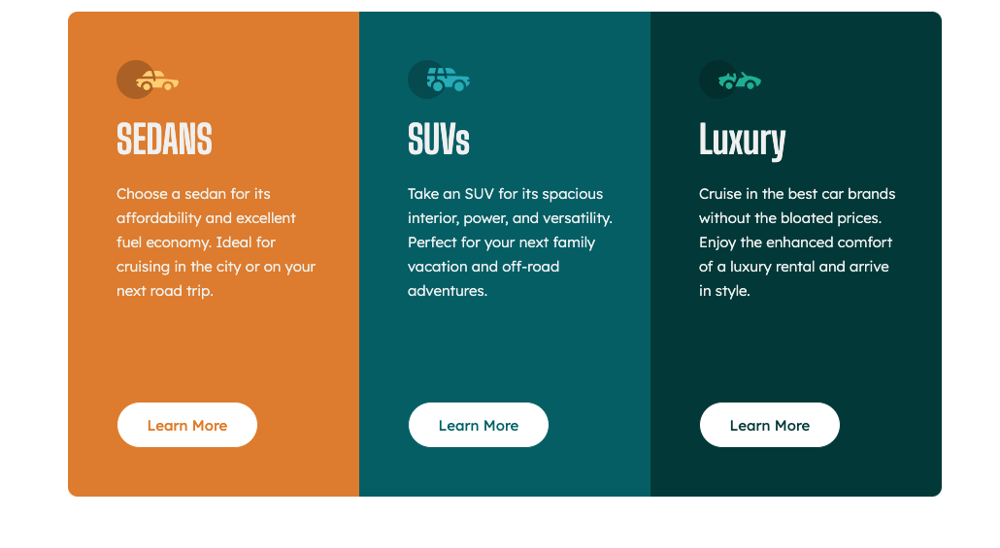

## Frontend Mentor - 3-column preview card component

### Reference
This is a challenge which can be found on front-end mentor
https://www.frontendmentor.io/challenges/3column-preview-card-component-pH92eAR2-

### Description
A simple 3 column layout, I decided to complete this tasking using vanilla HTML and CSS.
The live site can be found here
https://confident-engelbart-cd4275.netlify.app/